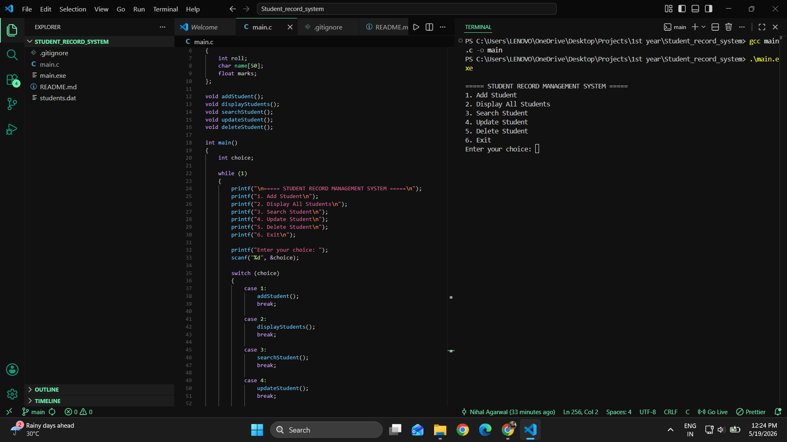
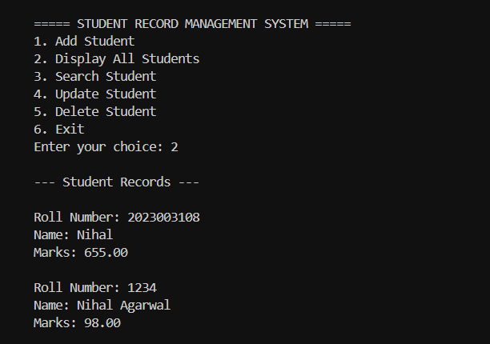

# Student Record Management System

A menu-driven console application developed in C for managing student records efficiently using file handling and structured programming concepts.

## Overview

This project allows users to perform complete CRUD (Create, Read, Update, Delete) operations on student data.  
The system stores records permanently using binary file handling, ensuring data persistence even after program termination.

The project was built to strengthen core programming fundamentals including structures, functions, arrays, and file management in C.

---

# Features

- Add new student records
- Display all stored records
- Search students using roll number
- Update existing student details
- Delete student records
- Persistent data storage using binary files
- Menu-driven user interface

---

# Concepts Implemented

## Core C Programming

- Structures
- Arrays
- Functions
- Conditional Statements
- Loops
- Strings

## File Handling

- fopen()
- fclose()
- fread()
- fwrite()
- fseek()
- remove()
- rename()

## Data Management

- Binary file storage
- Sequential file access
- Record modification
- Temporary file usage for deletion operations

---

# Project Structure

```text
student-record-management-system/
│
├── main.c
├── .gitignore
└── README.md
```

---

# How It Works

The application stores student records in a binary file named:

```text
students.dat
```

Each student record contains:

- Roll Number
- Name
- Marks

The system performs file operations dynamically whenever records are added, updated, searched, or deleted.

---

# Technologies Used

| Technology | Purpose |
|---|---|
| C | Core programming language |
| GCC | Compilation |
| VS Code | Development environment |
| Git | Version control |
| GitHub | Project hosting |

---

# Compilation & Execution

## Compile

```bash
gcc main.c -o main
```

## Run

```bash
.\main.exe
```

---

# Learning Outcomes

Through this project, the following concepts were practically implemented and understood:

- Structured programming
- Modular code design
- File-based data persistence
- CRUD operation implementation
- Binary file manipulation
- Debugging and compilation workflow
- Git and GitHub version control

---

# Future Improvements

- Duplicate roll number validation
- Student grade calculation
- Sorting records
- Password-based admin login
- Attendance management
- CGPA management system
- Colored terminal interface

---

# Application Preview

## Main Menu & Development Environment



---

## Adding Student Record


---

## Displaying Student Records



--- 

# Author

Nihal Agarwal

B.Tech CSBS Student  
GITAM University Hyderabad